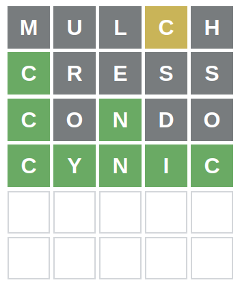

# wordler

Attempts to solve Wordle-like puzzles.

## Use

    $ ./wordler --help
    usage: wordler [-h] [--length LENGTH]
    
    Wordler.
    Try my guess and provide the results as follows:
    * '+' : Green, correct letter in correct place
    * '*' : Yellow, correct letter in incorrect place
    * '-' : Grey, incorrect letter not in the word
    e.g. : '--*++'
    'quit' to exit
    'reset' to restart
    
    optional arguments:
      -h, --help       show this help message and exit
      --length LENGTH  Length of the word to guess.  (default: 5)

## Example

    $ ./wordler 
    There are '4594' possible matches
    Try 'mulch'...
    Results [+*-] > ---*-
    There are '334' possible matches
    Try 'cress'...
    Results [+*-] > +----
    There are '20' possible matches
    Try 'condo'...
    Results [+*-] > +-+--
    There are '2' possible matches
    Try 'cynic'...
    Results [+*-] > 

